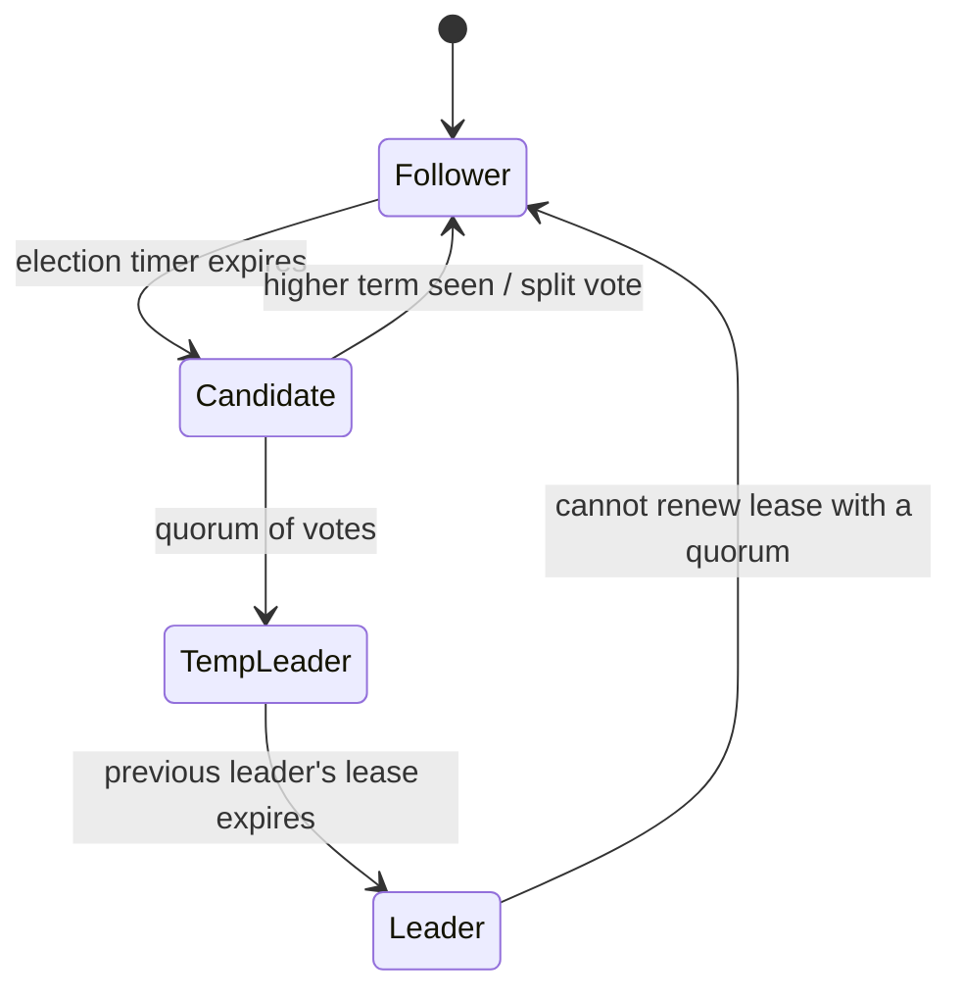

# Distributed Raft Consensus System

A fault-tolerant, replicated key-value store built on a from-scratch implementation of the
[Raft consensus algorithm](https://raft.github.io/raft.pdf), with **leader leases** for fast
linearizable reads. Five nodes communicate over gRPC, survive crashes and network failures,
and recover their state from disk on restart.

<p>
  
  
  
</p>

---

## What it does

| Capability | Detail |
|---|---|
| **Leader election** | Randomized election timeouts (5–10 s) elect a single leader per term and prevent split votes. |
| **Log replication** | Every write is appended to the leader's log and replicated to followers; it commits once a quorum acknowledges it. |
| **Fault tolerance** | A 5-node cluster tolerates 2 simultaneous failures. Leadership recovers automatically. |
| **Crash recovery** | Term, vote, log and commit index are fsynced to disk; a restarted node rejoins and catches up. |
| **Leader leases** | The leader serves reads from local memory without a round trip, while still guaranteeing linearizability. |
| **Log reconciliation** | Divergent follower logs are detected by `(prefixLen, prefixTerm)` and rewound entry by entry until they match. |
| **Client redirection** | The client discovers the leader, follows redirects, and round-robins the cluster when a node is unreachable. |

## Architecture

```
                    ┌──────────────┐
                    │    client    │   SET k v  /  GET k
                    └──────┬───────┘
                           │ ServeClient RPC (redirected to the leader)
                           ▼
        ┌─────────────────────────────────────────┐
        │            node 1  (LEADER)             │
        │  ┌───────────────┐   ┌───────────────┐  │
        │  │ replicated log│──▶│ state machine │  │
        │  └───────────────┘   │  (key→value)  │  │
        │                      └───────────────┘  │
        └───┬───────────┬───────────┬─────────┬───┘
            │ ProcessLog (AppendEntries + lease renewal)
     ┌──────▼───┐ ┌─────▼────┐ ┌────▼─────┐ ┌─▼────────┐
     │  node 2  │ │  node 3  │ │  node 4  │ │  node 5  │
     │ FOLLOWER │ │ FOLLOWER │ │ FOLLOWER │ │ FOLLOWER │
     └──────────┘ └──────────┘ └──────────┘ └──────────┘
```

Each node runs a gRPC server plus a background loop that drives its role:



`TempLeader` is the extra state the lease optimization requires: a node that has won an
election waits out the old leader's lease before acting, so two leaders can never serve
reads in overlapping windows.

## Quick start

### Locally

```bash
./setup.sh
```

```bash
source .venv/bin/activate && ./run_cluster.sh start
```

Five nodes start on ports `50051`–`50055` and elect a leader within about ten seconds.
Then talk to the store:

```bash
python client.py SET name alice
```

```bash
python client.py GET name
```

Or open the interactive shell with a bare `python client.py`. Watch consensus happen with
`tail -f logs_node_*/dump.txt`, and tear the cluster down with `./run_cluster.sh stop`.

### With Docker

```bash
docker compose up --build
```

```bash
docker compose run --rm client
```

## Seeing fault tolerance work

Kill the leader while the cluster is running:

```bash
./run_cluster.sh kill 1
```

A follower times out, campaigns, wins, waits for the dead leader's lease to lapse, and
takes over — all without losing a committed write:

```
[node 4] Node 4 election timer timed out, Starting election.
[node 4] New Leader waiting for Old Leader Lease to timeout.
[node 4] Node 4 became the leader for term 2.
```

The client notices on its next request and re-routes itself:

```
$ python client.py GET name
Node 1 unreachable, trying the next node.
Node 2 is not the leader, redirecting to 4.
Value: 'alice'
```

Bring the old leader back with `./run_cluster.sh restart 1` and it replays its disk state,
then catches up on everything it missed:

```
[node 1] Recovered term 1, 3 log entries, 3 committed.
[node 1] Node 1 accepted AppendEntries RPC from 4.
```

## How it works

### Consensus state

Each node keeps the state prescribed by the Raft paper. The **persistent** half —
`currentTerm`, `votedFor`, the replicated `log`, and `commitLength` — is written to disk
before it is acted on, which is what makes crash recovery safe. The **volatile** half —
current role, known leader, votes received, and per-follower `sentLength` / `ackedLength`
— is rebuilt after a restart.

### Writes

1. The client sends `SET k v` to the leader (any other node replies with a redirect).
2. The leader appends the entry to its log and calls `ProcessLog` on every follower.
3. A follower accepts the entry only if its log matches the leader's at `(prefixLen, prefixTerm)`;
   otherwise it rejects and the leader rewinds one entry and retries, walking back until the
   logs agree.
4. Once a quorum has acknowledged the entry, the leader commits it, applies it to the state
   machine, and reports success. Followers apply it when they learn the new `leaderCommit`.

Only entries from the leader's own term are committed by counting replicas (Raft §5.4.2).
To commit inherited entries, a new leader first appends a `NO-OP` entry in its own term.

### Reads and the leader lease

A naive Raft leader must contact a quorum on every read to prove it has not been deposed —
one round trip per read. Instead, every `ProcessLog` carries a lease interval, and a leader
that hears back from a quorum extends its lease. While the lease holds, the leader answers
`GET` from local memory. A leader that cannot renew steps down, and a newly elected leader
refuses to serve until every lease it learned about during the election has expired. Reads
stay linearizable while costing a single RPC — the same technique CockroachDB and etcd use.

### RPC interface

Defined in [`raft.proto`](raft.proto):

| RPC | Direction | Purpose |
|---|---|---|
| `RequestVote` | candidate → peers | Campaign for a term; the response also reports the voter's outstanding lease. |
| `ProcessLog` | leader → followers | AppendEntries: replicate a log suffix, advance the commit index, renew the lease. |
| `ServeClient` | client → node | `SET`/`GET`, or a redirect to the current leader. |

### On-disk state

Each node owns `logs_node_<id>/`:

| File | Contents |
|---|---|
| `metadata.txt` | `<currentTerm> <votedFor> <commitLength>` |
| `log.txt` | One entry per line: `<command> <term>` |
| `dump.txt` | Human-readable event log of elections, commits and RPCs |

## Project layout

```
raft_node.py      Consensus: elections, replication, commits, leases, gRPC server
storage.py        Durable state — metadata, replicated log, event dump
config.py         Cluster membership and timing constants
client.py         Leader-aware CLI client
raft.proto        gRPC service and message definitions
run_cluster.sh    Start/stop/kill nodes locally to exercise failover
docker-compose.yml  Five-node cluster on a private network
```

## Configuration

Peers are resolved from `RAFT_PEERS`, then `cluster.json`, then a localhost default — so the
same code runs on a laptop, under Docker, or across cloud VMs with no edits:

```bash
export RAFT_PEERS="10.0.0.1:50051,10.0.0.2:50052,10.0.0.3:50053,10.0.0.4:50054,10.0.0.5:50055"
```

Timings live in [`config.py`](config.py): a 10 s lease, 5–10 s randomized election timeouts,
1 s heartbeats, and a 1 s RPC deadline (kept well under the election timeout so one dead peer
can never stall the leader's loop). Quorum size is derived from the peer list, so a 3- or
7-node cluster works without code changes.

## Design notes and limitations

This is a teaching-grade implementation of the protocol, not a production datastore. The
tradeoffs worth naming:

- **Sequential replication.** The leader replicates to followers one at a time rather than in
  parallel, which bounds throughput. Every RPC carries a deadline so a dead peer costs at most
  one timeout per round.
- **Fixed membership.** Cluster size is static; joint-consensus membership changes are not
  implemented.
- **No log compaction.** The log grows without bound — snapshotting is the natural next step.
- **Durability.** State is written through Python file I/O without an explicit `fsync`, so a
  power loss (as opposed to a process crash, which is handled) could lose the last writes.
- **Security.** Channels are insecure gRPC; TLS and authentication are out of scope.

## References

- Ongaro & Ousterhout, [*In Search of an Understandable Consensus Algorithm*](https://raft.github.io/raft.pdf) (Raft, USENIX ATC '14)
- [The Raft visualization](https://raft.github.io/) — useful for building intuition about elections
- CockroachDB, [*Consistency, Detected*](https://www.cockroachlabs.com/blog/consensus-made-thrive/) — background on leader leases
